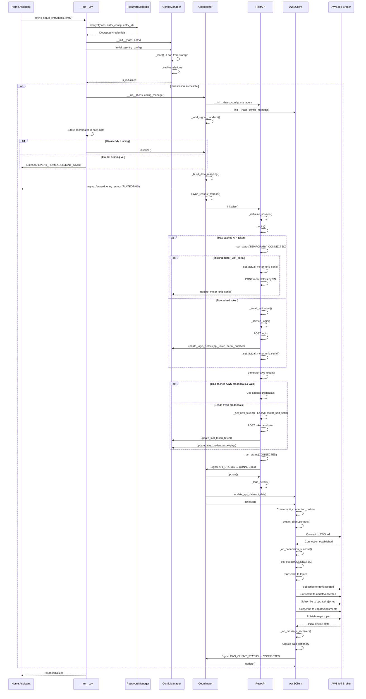
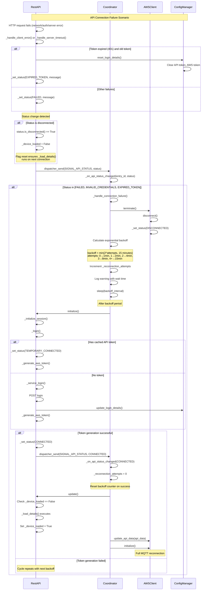
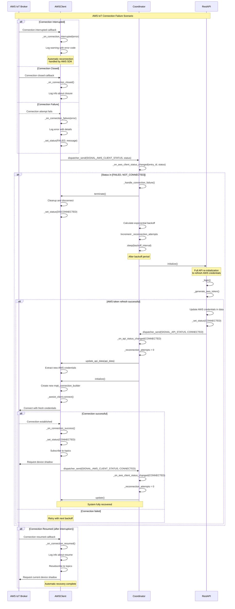
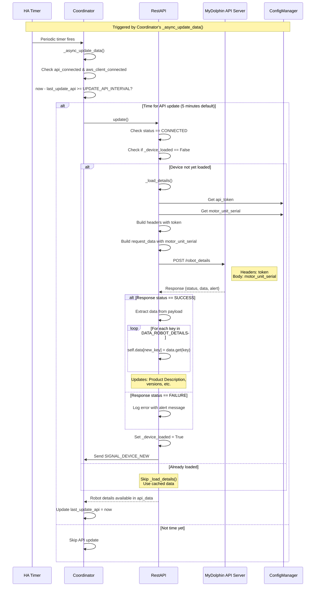
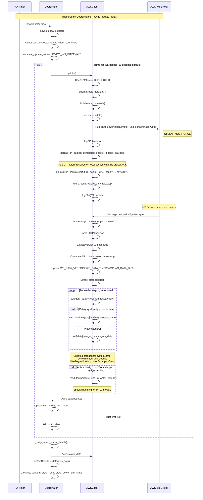
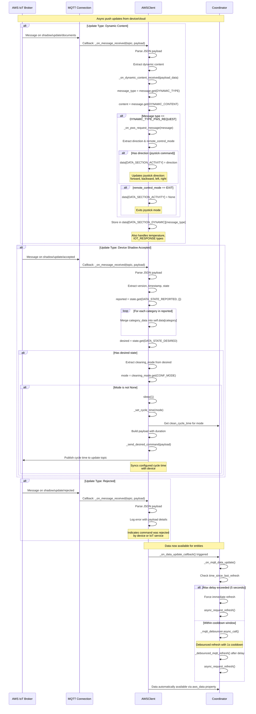
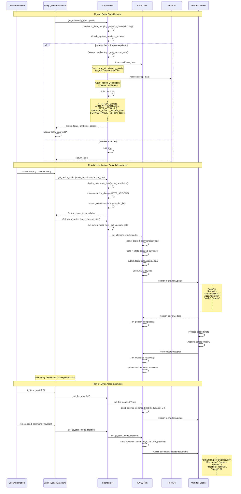

# MyDolphin Plus Integration Workflows

This document describes the key workflows in the MyDolphin Plus Home Assistant integration, including startup initialization and various update mechanisms.

> **Note**: This document contains Mermaid sequence diagrams. To view them properly:
>
> - On GitHub: Diagrams render automatically
> - In VS Code/Cursor: Install the "Markdown Preview Mermaid Support" extension
> - In other editors: Use a Mermaid-compatible Markdown viewer or preview on GitHub

## Table of Contents

- [Startup Flow](#startup-flow)
- [Recovery Flow](#recovery-flow)
- [Update Flows](#update-flows)
  - [Flow 1: Periodic API Update (REST)](#flow-1-periodic-api-update-rest)
  - [Flow 2: Periodic MQTT Update (Device Shadow Request)](#flow-2-periodic-mqtt-update-device-shadow-request)
  - [Flow 3: Real-time MQTT Push Updates](#flow-3-real-time-mqtt-push-updates)
  - [Flow 4: Entity Data Request & User Actions](#flow-4-entity-data-request--user-actions)

---

## Startup Flow

The startup flow describes how the integration initializes when Home Assistant loads it. This happens during HA startup or when the integration is added/reloaded.

### Overview

The integration follows these main steps:

1. **Configuration Loading**: Decrypt stored credentials and load configuration
2. **Component Initialization**: Create coordinator, API client, and AWS client instances
3. **Authentication**: Login to MyDolphin API and obtain tokens
4. **AWS IoT Connection**: Connect to AWS IoT MQTT broker
5. **Initial State Fetch**: Subscribe to topics and fetch initial device state

### Sequence Diagram



### Key Components

- **`__init__.py`**: Entry point, orchestrates the setup
- **`PasswordManager`**: Handles encrypted credential storage
- **`ConfigManager`**: Manages configuration and persistent storage
- **`Coordinator`**: Central coordinator for data updates and entity management
- **`RestAPI`**: Handles REST API communication with MyDolphin service
- **`AWSClient`**: Manages AWS IoT MQTT connection and real-time updates

### Authentication Flow

1. **API Token**: Obtained via email/password login to MyDolphin API
2. **Motor Unit Serial**: Retrieved using the API token
3. **AWS Token**: Generated by encrypting the motor unit serial
4. **AWS IoT Credentials**: Temporary IAM credentials obtained using the AWS token
5. **MQTT Connection**: Uses IAM credentials to connect to AWS IoT Core

---

## Recovery Flow

The recovery flow handles connection failures and implements automatic reconnection with exponential backoff. This ensures the integration can recover from temporary network issues, expired credentials, or service disruptions without manual intervention.

### Overview

When connections fail, the integration:

1. **Detects the failure** through status changes or connection callbacks
2. **Cleans up resources** by terminating AWS client connections
3. **Implements exponential backoff** to avoid overwhelming services during outages
4. **Attempts reconnection** by re-initializing the API client
5. **Resets state flags** to ensure fresh data fetch after recovery

### Recovery Scenarios

#### 1. API Connection Failures

- **Network errors**: Timeout, connection refused, DNS failures
- **Authentication issues**: Invalid credentials, expired tokens (401 errors)
- **Service issues**: API not found (404), server errors (500+)
- **Token expiration**: AWS IoT credentials expiring after TTL

#### 2. AWS IoT MQTT Failures

- **Connection interrupted**: Network drops, firewall changes
- **Connection closed**: Broker termination, credential expiration
- **Connection failure**: Initial connection attempt fails

#### 3. Coordinator Response

- **Status monitoring**: Listens to `SIGNAL_API_STATUS` and `SIGNAL_AWS_CLIENT_STATUS`
- **Exponential backoff**: 1min → 2min → 4min → 8min → 15min (max)
- **Resource cleanup**: Terminates AWS client before retry
- **Re-initialization**: Full API login and AWS connection cycle

### Sequence Diagram - API Disconnection & Recovery



### Sequence Diagram - AWS IoT Disconnection & Recovery



### Exponential Backoff Strategy

The integration uses exponential backoff to handle reconnection attempts gracefully:

| Attempt | Backoff Time | Calculation  |
| ------- | ------------ | ------------ |
| 1st     | 1 minute     | 2^0 = 1      |
| 2nd     | 2 minutes    | 2^1 = 2      |
| 3rd     | 4 minutes    | 2^2 = 4      |
| 4th     | 8 minutes    | 2^3 = 8      |
| 5th+    | 15 minutes   | max(2^n, 15) |

**Benefits**:

- Prevents overwhelming services during outages
- Reduces unnecessary API calls during extended failures
- Allows time for transient issues to resolve
- Caps maximum wait time at 15 minutes

### Key Recovery Mechanisms

#### 1. Flag Reset on Disconnection

```python
# In RestAPI._set_status()
if status.is_disconnected():
    self._device_loaded = False
```

When API status becomes disconnected, the `_device_loaded` flag resets to `False`, ensuring that device details are fetched fresh on reconnection.

#### 2. Coordinator Status Listeners

```python
# Registered in Coordinator._load_signal_handlers()
SIGNAL_API_STATUS -> _on_api_status_changed()
SIGNAL_AWS_CLIENT_STATUS -> _on_aws_client_status_changed()
```

The coordinator monitors both API and AWS client status changes to trigger appropriate recovery actions.

#### 3. AWS Client Termination

```python
# In Coordinator._handle_connection_failure()
await self._aws_client.terminate()
```

Before attempting reconnection, the AWS client is properly terminated to clean up resources and reset connection state.

#### 4. Full Re-initialization

```python
# In Coordinator._handle_connection_failure()
await self._api.initialize()
```

Recovery triggers a full API re-initialization, which includes:

- Re-authentication (if needed)
- Fresh AWS IoT credentials
- New MQTT connection
- Topic re-subscription
- Initial state fetch

### Recovery Success Indicators

When recovery is successful:

1. ✅ `_reconnection_attempts` counter resets to 0
2. ✅ API status becomes `CONNECTED`
3. ✅ AWS client status becomes `CONNECTED`
4. ✅ `_device_loaded` flag is `False`, triggering fresh data fetch
5. ✅ Device shadow is requested and received
6. ✅ Entities update with current state
7. ✅ Normal operation resumes

### Failure Persistence

If reconnection continues to fail:

- Backoff time increases up to 15-minute maximum
- System keeps retrying indefinitely
- Home Assistant logs warnings with attempt numbers
- Entities show unavailable state
- User can manually reload integration to force immediate retry

---

## Update Flows

The integration uses four distinct update mechanisms to keep device state synchronized:

1. **Periodic API Update (REST)**: Less frequent updates of static data
2. **Periodic MQTT Update**: Regular polling of device shadow
3. **Real-time MQTT Push**: Async updates pushed from the cloud/device
4. **Entity Data Request**: On-demand data retrieval and user actions

---

## Flow 1: Periodic API Update (REST)

Fetches robot details from the MyDolphin REST API. This retrieves relatively static information like product description and firmware versions.

**Important**: The `_load_details()` method only executes **once per connection session**. After the initial fetch following a connection, it won't run again until the API disconnects and reconnects. This optimization reduces unnecessary API calls since device details rarely change.

### Sequence Diagram



### Timing

- **Check Interval**: The coordinator checks every 5 minutes (`UPDATE_API_INTERVAL`) if it's time to call `update()`
- **Actual Execution**: `_load_details()` only runs **once per connection**, not every 5 minutes
- **First Run**: Immediately after successful API connection on the first coordinator update cycle
- **Configurable**: Interval can be adjusted via constants in `consts.py`

### Data Retrieved

- Product Description
- Hardware Version
- Software Version
- PWS (Power Supply) Version
- Other static robot details

### Behavior

The `update()` method checks the `_device_loaded` flag to determine whether to fetch device details:

- **First Connection**: On the first `update()` call after successful API connection, `_device_loaded` is `False`, so `_load_details()` executes and fetches robot details from the API server
- **Subsequent Updates**: Flag is set to `True`, so `_load_details()` is skipped (details are cached in `api_data`)
- **After Disconnection**: When the API status transitions to any disconnected state (via `_set_status()`), the `_device_loaded` flag is automatically reset to `False`
  - Disconnected states: `DISCONNECTED`, `FAILED`, `INVALID_CREDENTIALS`, `EXPIRED_TOKEN`, `API_NOT_FOUND`, `NOT_CONNECTED`
- **Next Reconnection**: `_load_details()` will execute once again on the first `update()` call

**Rationale**: Device details (product info, firmware versions) are static and don't change during a connection session. This optimization significantly reduces API calls while ensuring fresh data is retrieved after any reconnection (which might indicate a firmware update or device replacement).

---

## Flow 2: Periodic MQTT Update (Device Shadow Request)

Requests the full device shadow state from AWS IoT at regular intervals (default: 30 seconds). This ensures the integration has the latest state even if push notifications are missed.

### Sequence Diagram



### Interval

- **Default**: 30 seconds (`UPDATE_WS_INTERVAL`)
- **Configurable**: Can be adjusted via constants

### Data Retrieved

- **System State**: Power supply state, robot state, turn-on count
- **Cycle Info**: Cleaning mode, cycle duration, start time
- **LED Settings**: Enable state, mode, intensity
- **WiFi Info**: Network name, RSSI
- **Debug Info**: WiFi signal strength, diagnostics
- **Filter Status**: Filter bag indication state
- **Errors**: Robot errors, power supply errors

### AWS IoT Topics

- **Request**: `$aws/things/{motor_unit_serial}/shadow/get`
- **Response**: `$aws/things/{motor_unit_serial}/shadow/get/accepted`

---

## Flow 3: Real-time MQTT Push Updates

Handles asynchronous messages pushed from AWS IoT when the device state changes. This provides real-time responsiveness without polling.

### Sequence Diagram



### MQTT Update Debouncing

To optimize performance and prevent excessive coordinator refreshes, MQTT updates are debounced:

- **Debounce Cooldown**: 1.0 second - Multiple rapid updates are batched together
- **Maximum Delay Safety Net**: 5.0 seconds - Forces immediate refresh if no update occurred for too long
- **Callback Mechanism**: AWSClient triggers `_on_mqtt_data_update()` callback after processing each message
- **Coordinator Response**: Debouncer ensures coordinator refresh happens at most once per second, even with multiple rapid MQTT messages

**Benefits**:

- Reduces CPU usage by batching rapid updates
- Prevents UI flicker from excessive entity updates
- Ensures responsiveness with safety net for missed updates
- Optimizes Home Assistant entity refresh cycles

### Message Types

#### 1. Dynamic Content (`shadow/update/documents`)

- **Joystick Control**: Real-time direction updates during manual control
- **Temperature**: Water temperature readings (M700 models)
- **IoT Responses**: Various device responses and status updates

#### 2. Shadow Updates (`shadow/update/accepted`)

- **State Changes**: Robot status, cleaning mode, power supply state
- **Configuration Sync**: Cycle time synchronization after mode changes
- **Sensor Updates**: Filter status, LED state, WiFi info

#### 3. Error Messages (`shadow/update/rejected`)

- **Command Failures**: When a command cannot be executed
- **Validation Errors**: Invalid command parameters

### AWS IoT Topics

- **Dynamic**: `$aws/things/{motor_unit_serial}/shadow/update/documents`
- **Update Accepted**: `$aws/things/{motor_unit_serial}/shadow/update/accepted`
- **Update Rejected**: `$aws/things/{motor_unit_serial}/shadow/update/rejected`

---

## Flow 4: Entity Data Request & User Actions

Handles on-demand entity state requests and user-initiated actions (like starting the vacuum or changing LED settings).

### Sequence Diagram



### Entity State Retrieval

The coordinator maintains a mapping of entity descriptions to data handler functions:

```python
data_mapping = {
    "status": _get_status_data,
    "vacuum": _get_vacuum_data,
    "led": _get_led_data,
    "rssi": _get_rssi_data,
    "filter_status": _get_filter_status_data,
    # ... and more
}
```

When an entity requests data, the appropriate handler:

1. Accesses AWS IoT data and/or REST API data
2. Processes and transforms the raw data
3. Returns a dictionary with state, attributes, and available actions

### User Actions

User actions are implemented as async methods in the coordinator and include:

#### Vacuum Actions

- **Start**: `_vacuum_start()` - Starts cleaning with current mode
- **Pause**: `_vacuum_pause()` - Pauses the cleaning cycle
- **Return to Base**: `_pickup()` - Returns robot to dock
- **Set Fan Speed**: `_set_cleaning_mode()` - Changes cleaning mode
- **Locate**: `_vacuum_locate()` - Enables LED for locating

#### LED Actions

- **Turn On/Off**: `_set_led_enabled()` / `_set_led_disabled()`
- **Set Intensity**: `_set_led_intensity()`
- **Set Mode**: `_set_led_mode()` - Change LED pattern

#### Remote Control Actions

- **Send Command**: `_set_joystick_mode()` - Manual directional control
- **Exit Manual Mode**: `_exit_joystick_mode()`

### Command Types

#### Desired State Commands

Published to `shadow/update` to change persistent device state:

- Cleaning mode
- LED settings
- Schedule configuration
- Cycle time

#### Dynamic Commands

Published to `shadow/update/documents` for immediate, non-persistent actions:

- Joystick control (forward, backward, left, right)
- Pause/resume
- Pickup

---

## Summary

The MyDolphin Plus integration uses a **robust, multi-layered approach**:

### Core Flows

1. **Startup Flow**: Initial authentication and connection establishment
2. **Recovery Flow**: Automatic reconnection with exponential backoff (1-15 min)
3. **Update Flows**:
   - Periodic REST API calls for static information (5 min interval, once per connection)
   - Periodic MQTT shadow requests for reliable state sync (30 sec interval)
   - Real-time MQTT push notifications with debouncing for immediate updates (async, 1s debounce, 5s max delay)
   - On-demand entity requests for user actions and state queries

### Architecture Benefits

- **Reliability**: Periodic polling ensures state is eventually consistent; automatic recovery handles failures
- **Responsiveness**: Real-time MQTT provides immediate updates with debouncing (1s cooldown, 5s max delay); sub-second command execution
- **Efficiency**: Smart caching (device details once per connection), rate limiting, and backoff strategies minimize unnecessary API calls
- **Resilience**: Exponential backoff and automatic recovery ensure graceful handling of network/service disruptions
- **Flexibility**: Separate update mechanisms can be tuned independently; recovery is transparent to users

---

## Configuration

Key timing constants (from `consts.py`):

```python
# Update Intervals
UPDATE_ENTITIES_INTERVAL = timedelta(seconds=5)   # Entity refresh rate
UPDATE_API_INTERVAL = timedelta(minutes=5)        # REST API check interval
UPDATE_WS_INTERVAL = timedelta(seconds=30)        # MQTT shadow request interval

# Recovery Settings
RECONNECT_BACKOFF_MAX = timedelta(minutes=15)     # Maximum backoff time
MIN_TOKEN_FETCH_INTERVAL = timedelta(minutes=5)   # Rate limit for token refresh
AWS_CREDENTIALS_TTL = timedelta(hours=1)          # AWS IoT credential lifetime
```

**Update Intervals**: Control how frequently the coordinator checks for updates and refreshes data.

**Recovery Settings**:

- `RECONNECT_BACKOFF_MAX`: Caps exponential backoff at 15 minutes
- `MIN_TOKEN_FETCH_INTERVAL`: Prevents excessive API calls during token refresh attempts
- `AWS_CREDENTIALS_TTL`: AWS IoT credentials expire after 1 hour, triggering automatic refresh

These can be adjusted based on your needs for responsiveness vs. resource usage.
